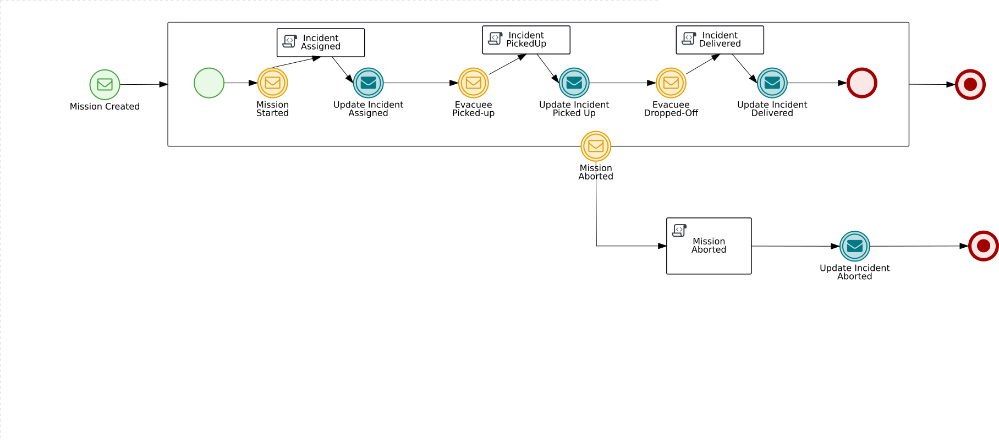
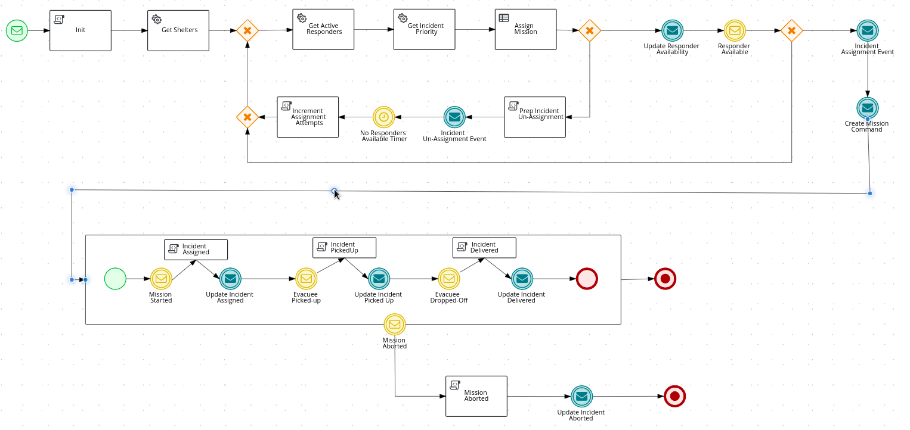
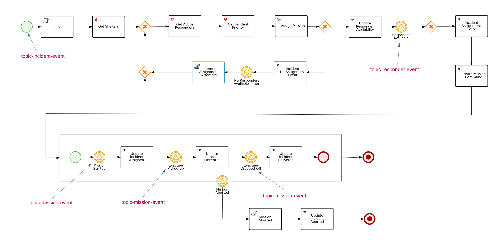
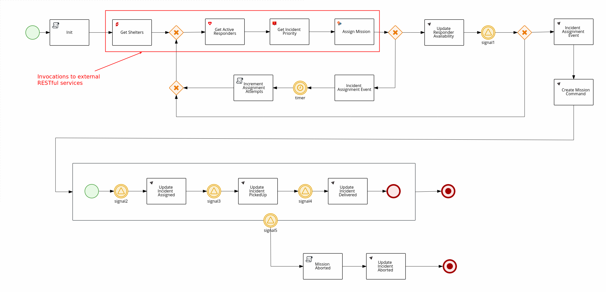

= RH-PAM 7 -> Kogito Migration Journal

== Purpose
Purpose of this document is to maintain a history of the migration effort of ER-Demo's _process-service_ from RH-PAM 7 (embedded in SpringBoot) to Kogito.

== Summary

. Accessibility of process variables
+
Kogito provides direct reference to process variables from process tasks and conditionals.
For example, instead of the following used in a BPMN2 for RH-PAM 7 :
+
-----
<![CDATA[Boolean _isAvailable = (Boolean)kcontext.getVariable("responderIsAvailable");
return (_isAvailable);]]>
-----
+
the following can instead be written with a BPMN2 that runs in Kogito:
+
-----
return responderIsAvailable;
-----

. Process Id needs to facilitate auto-generation of Java class files
+
Kogito auto-generates Java class files from the _processId_ of a BPMN2.
Subsequently, the processId needs to be of a simple String convention with no special characters.

. The refactored ER-Demo process-service using Kogito makes heavy use of overloaded Kafka topics using multiple incoming client channels.  This should be documented and provided as an isolated quickstart in the kogito project as per link:https://issues.redhat.com/browse/KOGITO-3730[KOGITO-3730].

== Journal Details

. 17 March 20201
.. Cloud Events PoC using different `cloud-events-mode`
... It appears that the consumer functionality of the CloudEvents Java client is intelligent enough to auto-detect whether the mode of an incoming message is `binary` or `structured`
+
The CloudEvents Java client is able to gracefully process a message of any mode without any additional configuration or code.
... The producer functionality of the cloud event Java client can be configured to send in `binary` mode (which is the default) or `structured`.
+
Example configuration as follows:
+
-----
mp.messaging.outgoing.cloud-event-outgoing.cloud-events-mode=structured
-----

. 10 February 2021
.. TO-DO: Implement ER-Demo <-> Kogito topics mapping as per:  link:https://quarkus.io/guides/kafka#the-price-converter[Quarkus PriceConverter]
.. TO-DO: Leverage CloudEvents based ER-Demo

. 3 February 2021
.. TO-DO:  With quarkus, need research how to enable debug logging for: org.kie.kogito.event.impl.CloudEventConsumer    (which uses slf4j and not org.jboss.logmanager.LogManager)

.. Documentation:  It would be nice to better document the following :
... use of   link:https://github.com/cloudevents/sdk-java/blob/master/core/src/main/java/io/cloudevents/core/builder/CloudEventBuilder.java#L151[io.cloudevents.core.builder.CloudEventBuilder.v1.useExtension( ... )] to add kogito specific elements to a CloudEvent sent to Kogito
... Kogito specific CloudEvent extension keys (as per:  link:https://github.com/kiegroup/kogito-runtimes/blob/master/api/kogito-services/src/main/java/org/kie/kogito/services/event/AbstractProcessDataEvent.java#L23-L30[AbstractProcessDataEvent])

.. Does link:https://issues.redhat.com/browse/KOGITO-2398[KOGITO-2398] make sense ?

. 24 Jan 2021
.. Created link:https://issues.redhat.com/browse/KOGITO-4249[KOGITO-4249]
.. On Entry Action for a embedded sub-process does not seem to execute.
+
In particular, the java code snippet is not being included in the auto-generated kogito class.

. *19 Jan 2021*
.. Upgraded to kogito 1.1.0.Final and tested with TestContainers invoking podman (rather than docker)
... Started podman service
+
-----
$ podman system service -t 0 tcp:localhost:8880 &
-----
... Set the following env vars in surefire-plugin in pom.xml
+
-----
          <environmentVariables>
            <DOCKER_HOST>tcp://localhost:8880</DOCKER_HOST>
            <TESTCONTAINERS_RYUK_DISABLED>false</TESTCONTAINERS_RYUK_DISABLED>
            <api.version>v2</api.version>
          </environmentVariables>
-----
... Expectations:
+
The following container images should be pulled by podman:
+
-----
confluentinc/cp-kafka         5.4.3               c96219294d0f        3 months ago        667MB
testcontainers/ryuk           0.3.0               03cb4444a82d        7 months ago        12MB
-----

... Results:
.... Exception:
+
-----
Caused by: java.lang.RuntimeException: Unable to start Quarkus test resource org.kie.kogito.testcontainers.quarkus.KafkaQuarkusTestResource@4730e0f0
Caused by: com.github.dockerjava.api.exception.DockerClientException: Could not pull image:
-----

.... both container images were successfully pulled (eventually):
+
-----
$ podman images | grep 'testcontainers\|confluent'

docker.io/confluentinc/cp-kafka                         5.4.3               c96219294d0f  3 months ago   682 MB
docker.io/testcontainers/ryuk                           0.3.0               03cb4444a82d  7 months ago   12.5 MB
-----

.... podman related logs during (and well after) test execution:
+
-----
Jan 19 09:52:15 p50 podman[441122]: 2021-01-19 09:52:15.189453364 -0700 MST m=+753.855911220 image pull  
Jan 19 09:52:53 p50 systemd[2291]: libpod-conmon-c5728d83c3cc1c16ab7c167b406b088097018c53fde98e9fa4a079cae0e3a23b.scope: Succeeded.
-----

.. Buried JsonProcessingException
... https://github.com/kiegroup/kogito-runtimes/blob/1.1.0.Final/jbpm/jbpm-flow/src/main/java/org/kie/kogito/event/impl/CloudEventConsumer.java#L89-L94
... Recommendation :
.... Change log level to error
.... In addition to logging error, throw a RuntimeException
... Root Issue:
+
-----
"com.fasterxml.jackson.databind.exc.MismatchedInputException: Cannot construct instance of `com.redhat.cajun.navy.rules.model.Mission` (although at least one Creator exists): no String-argument constructor/factory method to deserialize from String value ('eyJpbmNpZGVudElkIjoiaW5jaWRlbnQxIiwicmVzcG9uZGVySWQiOiJyZXNwb25kZXIxIiwic3RhdHVzIjoiVU5BU1NJR05FRCIsInJlc3BvbmRlclN0YXJ0TGF0IjoyLCJyZXNwb25kZXJTdGFydExvbmciOjIsImluY2lkZW50TGF0IjowLCJpbmNpZGVudExvbmciOjAsImRlc3RpbmF0aW9uTGF0IjoxLCJkZXN0aW5hdGlvbkxvbmciOjEsImxhc3RVcGRhdGUiOjE2MTEwOTUwMzI5NTV9')
>  at [Source: (String)"{"data":"eyJpbmNpZGVudElkIjoiaW5jaWRlbnQxIiwicmVzcG9uZGVySWQiOiJyZXNwb25kZXIxIiwic3RhdHVzIjoiVU5BU1NJR05FRCIsInJlc3BvbmRlclN0YXJ0TGF0IjoyLCJyZXNwb25kZXJTdGFydExvbmciOjIsImluY2lkZW50TGF0IjowLCJpbmNpZGVudExvbmciOjAsImRlc3RpbmF0aW9uTGF0IjoxLCJkZXN0aW5hdGlvbkxvbmciOjEsImxhc3RVcGRhdGUiOjE2MTEwOTUwMzI5NTV9","id":"5a753ac2-06fc-4343-8514-29e866e14e62","source":"","type":"Mission","subject":null,"time":1611095032.987476000,"dataContentType":null,"dataSchema":null,"specVersion":"V1","extensionNames":[],""[truncated 60 chars]; line: 1, column: 9] (through reference chain: com.redhat.cajun.navy.process.MissionLifecycleMessageDataEvent_18["data"])"
-----

.. CloudEventClass.getSimpleName()
+
link:https://github.com/kiegroup/kogito-examples/blob/stable/process-kafka-quickstart-quarkus/src/test/java/org/acme/travel/MessagingIT.java#L105[MessagingIT.java#L105]

. *15 Dec. 2020*
.. Encountered the following error upon testing:
+
-----
$ mvn clean test -e

...

java.lang.RuntimeException: java.lang.RuntimeException: Failed to start quarkus
Caused by: java.lang.RuntimeException: Failed to start quarkus
Caused by: java.lang.RuntimeException: Error injecting io.smallrye.mutiny.Multi<org.eclipse.microprofile.reactive.messaging.Message<java.lang.String>> org.kie.kogito.addon.cloudevents.quarkus.QuarkusCloudEventPublisher.events
Caused by: java.lang.IllegalStateException: SRMSG00018: Unable to find a stream with the name kogito_incoming_stream, available streams are: [kogito_outgoing_stream, i-mission-event-pickedup, i-mission-event-started, i-responder-availability-verified, i-mission-event-droppedoff, i-mission-event-aborted, i-incident-event-created, i-mission-event-created]
-----

... Even with the '-e' flag, stacktrace doesn't pin-point the exact line of code throwing the root exception.
... The app does not make use of a microprofile stream called: _kogito_incoming_stream_.  It's not clear which task in the BPMN is the cause of the problem.

... Recommendation pertaining to:  link:https://github.com/kiegroup/kogito-runtimes/blob/master/addons/cloudevents/cloudevents-quarkus-addon/src/main/java/org/kie/kogito/addon/cloudevents/quarkus/QuarkusTopicDiscovery.java#L63-L74[QuarkusTopicDiscovery.extractChannelName( ... )]
.... Instead of attempting to use KogitoEventStreams.INCOMING when the exact microprofile stream config doesn't exist, it might be better that a RuntimeException be thrown that highlights the missing config in application.properties.
.... Otherwise, if KogitoEventStreams.INCOMING is to be used, a WARN level message should be logged explaining the problem and the use of KogitoEventStreams.INCOMING as the default.

. *4 Dec. 2020*
+
Added the following to pom.xml :
+
-----
    <dependency>
      <groupId>org.kie.kogito</groupId>
      <artifactId>kogito-cloudevents-quarkus-addon</artifactId>
    </dependency>
-----
+
So as to prevent exceptions similar to the following during compilation of generated source:
+
-----
[ERROR] 	Suppressed: javax.enterprise.inject.UnsatisfiedResolutionException: Unsatisfied dependency for type org.kie.kogito.services.event.CloudEventEmitter and qualifiers [@Default]
[ERROR] 	- java member: com.redhat.cajun.navy.process.MissionLifecycleMessageProducer_11#emitter
[ERROR] 	- declared on CLASS bean [types=[org.kie.kogito.services.event.impl.AbstractMessageProducer<com.redhat.cajun.navy.rules.model.Incident, com.redhat.cajun.navy.process.MissionLifecycleMessageDataEvent_11>, com.redhat.cajun.navy.process.MissionLifecycleMessageProducer_11, java.lang.Object], qualifiers=[@Default, @Any], target=com.redhat.cajun.navy.process.MissionLifecycleMessageProducer_11]
[ERROR] 		at io.quarkus.arc.processor.Beans.resolveInjectionPoint(Beans.java:504)
[ERROR] 		at io.quarkus.arc.processor.BeanInfo.init(BeanInfo.java:363)
[ERROR] 		at io.quarkus.arc.processor.BeanDeployment.init(BeanDeployment.java:233)

-----

. *2 Dec. 2020*
.. CloudEvents / Kogito references
+
-----
https://github.com/kiegroup/kogito-runtimes/pull/912/files
https://github.com/kiegroup/kogito-runtimes/pull/807
https://github.com/kiegroup/kogito-examples/pull/386/files
https://github.com/evacchi/reactive-messaging-poc
https://github.com/cloudevents/sdk-java
-----

. *25 November 2020*

.. org.kie.kogito.event.impl.DataEventConsumer appears to only implement (as of 0.17.0) starting a new process instance
... Compare with org.kie.kogito.eventimpl.CloudEventConsumer, which implements both start and signalling of process instance

.. The reason the DataEventConsumer is currently being used (by setting:  kogito.messaging.as-cloudevents=false) is because we are attempting to re-use existing payloads from a brownfield app
+
For the purpose of this exercise, we could switch to cloud-events if needed

.. The runtime stack trace that indicates the problem is as follows:
+
-----
INFO  [io.quarkus] (Quarkus Main Thread) Installed features: [cdi, kogito, kubernetes-client, mutiny, resteasy, resteasy-jackson, smallrye-context-propagation, smallrye-health, smallrye-openapi, smallrye-reactive-messaging, smallrye-reactive-messaging-kafka, swagger-ui, vertx]
INFO  [io.quarkus.deployment.dev.RuntimeUpdatesProcessor] (vert.x-worker-thread-11) Hot replace total time: 1.107s 
ERROR [io.smallrye.reactive.messaging.provider] (vert.x-eventloop-thread-12) SRMSG00200: The method com.redhat.cajun.navy.process.MissionLifecycleMessageConsumer_14#consume has thrown an exception: java.lang.IllegalArgumentException: There is no start node that matches the trigger i-mission-event-started
	at org.jbpm.ruleflow.instance.RuleFlowProcessInstance.internalStart(RuleFlowProcessInstance.java:39)
	at org.jbpm.process.instance.impl.ProcessInstanceImpl.start(ProcessInstanceImpl.java:232)
	at org.jbpm.workflow.instance.impl.WorkflowProcessInstanceImpl.start(WorkflowProcessInstanceImpl.java:473)
	at org.jbpm.process.instance.LightProcessRuntime.startProcessInstance(LightProcessRuntime.java:174)
	at org.jbpm.process.instance.LightProcessRuntime.startProcessInstance(LightProcessRuntime.java:161)
	at org.kie.kogito.process.impl.AbstractProcessInstance.start(AbstractProcessInstance.java:212)
	at org.kie.kogito.event.impl.DataEventConsumer.lambda$consume$0(DataEventConsumer.java:52)
	at org.kie.kogito.services.uow.UnitOfWorkExecutor.executeInUnitOfWork(UnitOfWorkExecutor.java:33)
	at org.kie.kogito.event.impl.DataEventConsumer.consume(DataEventConsumer.java:47)
	at com.redhat.cajun.navy.process.MissionLifecycleMessageConsumer_14.consume(MissionLifecycleMessageConsumer_14.java:39)
	at com.redhat.cajun.navy.process.MissionLifecycleMessageConsumer_14_ClientProxy.consume(MissionLifecycleMessageConsumer_14_ClientProxy.zig:214)
	at com.redhat.cajun.navy.process.MissionLifecycleMessageConsumer_14_SmallRyeMessagingInvoker_consume_a793a9cc76abe8ea0eedf6d7f2db6d132889e355.invoke(MissionLifecycleMessageConsumer_14_SmallRyeMessagingInvoker_consume_a793a9cc76abe8ea0eedf6d7f2db6d132889e355.zig:48)
-----

. *24 November 2020*

.. link:https://issues.redhat.com/browse/KOGITO-3932[KOGITO-3932]
+
Kogito BPMN plugin for VSCode (v0.8.0) does not update underlying itemDefinition when Intermediate Message Catch Event is modified.  ie: 
+
-----
<bpmn2:itemDefinition id="topic-responder-availability-verifiedType" structureRef="com.redhat.cajun.navy.process.message.model.ResponderUpdatedEvent"/>
-----

... Troubleshooting the root issue requires studying the BPMN XML.  No hints of a problem are provided via the editor.

... Instead, the following is thrown during compilation:
+
-----
[INFO] ------------------------------------------------------------------------
[INFO] BUILD FAILURE
[INFO] ------------------------------------------------------------------------
[INFO] Total time:  10.709 s
[INFO] Finished at: 2020-11-24T08:05:55-07:00
[INFO] ------------------------------------------------------------------------
[ERROR] Failed to execute goal io.quarkus:quarkus-maven-plugin:1.8.0.Final:build (default) on project process-service-kogito: Failed to build quarkus application: io.quarkus.builder.BuildException: Build failure: Build failed due to errors
[ERROR] 	[error]: Build step org.kie.kogito.quarkus.deployment.KogitoAssetsProcessor#generateModel threw an exception: java.lang.IllegalStateException: src/main/java/com/redhat/cajun/navy/process/IncidentLifecycleMessageConsumer_2.java (37:31) : incompatible types: com.redhat.cajun.navy.rules.model.Mission cannot be converted to com.redhat.cajun.navy.rules.model.Incident
[ERROR] src/main/java/com/redhat/cajun/navy/process/IncidentLifecycleMessageConsumer_2.java (37:31) : incompatible types: com.redhat.cajun.navy.rules.model.Mission cannot be converted to com.redhat.cajun.navy.rules.model.Incident
[ERROR] 	at org.kie.kogito.quarkus.deployment.InMemoryCompiler.compile(InMemoryCompiler.java:95)
[ERROR] 	at org.kie.kogito.quarkus.deployment.KogitoAssetsProcessor.processGeneratedJavaSourceCode(KogitoAssetsProcessor.java:261)
[ERROR] 	at org.kie.kogito.quarkus.deployment.KogitoAssetsProcessor.generateModel(KogitoAssetsProcessor.java:217)
-----
+
This error message leads the user to believe the error might be something other than a problem in the underlying BPMN XML.

... Troubleshooting involves multiple steps:
.... Study stack trace and open target/generated-source/kogito/com/redhat/cajun/navy/process/IncidentLifecycleMessageConsumer_2.java:37
.... Notice that this function pertains to an incoming message channel:
+
-----
@org.eclipse.microprofile.reactive.messaging.Incoming("topic-incident-event-created")
-----
.... Question why this function is expecting an event type of Mission.class
.... Study the BPMN XML in and around the use of:   topic-incident-event-created

... To correct the problem, the user either has to manually fix the XML or delete the entire Intermediate Message Catch Event and re-create.

.. Difficulties troubleshooting kafka from testcontainers

... No exception is thrown to unit test when kafka producer is not connected to kafka broker
... Consumer also provides no indication that it is not connected to kafka broker

. *21 October 2020*

.. Specifying multiple inbound and outgoing messaging channels in application.properties for each topic has resolved issues thrown by smallrye.

. *19 October 2020*

.. A new BPMN called *mission-lifecycle* has been created.  This process isolates the mission-lifecycle embedded sub-process from the original *incident-process*.
+

.. Two BPMN2 definitions in same project with same processId.  [red]#kogito compiler does not identify this conflict upfront.  Downstream consequences occur#
... Fixed by link:https://issues.redhat.com/browse/KOGITO-3681[KOGITO-3681]

.. SmallRyeReactiveMessagingLifecycle does not allow app to both consume and produce messages to the same Kafka topic (ie: *topic-incident-event*).
... The following is thrown when executing com.redhat.cajun.navy.process.IncidentProcessTest
+
-----
Caused by: javax.enterprise.inject.spi.DeploymentException: SRMSG00073: Invalid configuration, the following channel names cannot be used for both incoming and outgoing: [topic-incident-event]
	at io.smallrye.reactive.messaging.impl.ConfiguredChannelFactory.detectNameConflict(ConfiguredChannelFactory.java:144)
	at io.smallrye.reactive.messaging.impl.ConfiguredChannelFactory.initialize(ConfiguredChannelFactory.java:125)
	at io.smallrye.reactive.messaging.impl.ConfiguredChannelFactory_ClientProxy.initialize(ConfiguredChannelFactory_ClientProxy.zig:265)
	at java.base/java.util.Iterator.forEachRemaining(Iterator.java:133)
	at java.base/java.util.Spliterators$IteratorSpliterator.forEachRemaining(Spliterators.java:1801)
	at java.base/java.util.stream.ReferencePipeline$Head.forEach(ReferencePipeline.java:658)
	at io.smallrye.reactive.messaging.extension.MediatorManager.initializeAndRun(MediatorManager.java:161)
	at io.smallrye.reactive.messaging.extension.MediatorManager_ClientProxy.initializeAndRun(MediatorManager_ClientProxy.zig:325)
	at io.quarkus.smallrye.reactivemessaging.runtime.SmallRyeReactiveMessagingLifecycle.onApplicationStart(SmallRyeReactiveMessagingLifecycle.java:20)
-----
... [red]#Recommendation:  Detail this restriction in Kogito docs#.
... [red]#Recommendation:  In ER-Demo, create additional outgoing topic called:  *topic-incident-assignment-event*#

.. SmallRye doesn't allow multiple consumers on same Kafka topic:
+
-----
Oct 19, 2020 1:41:09 PM io.smallrye.reactive.messaging.kafka.impl.KafkaSource lambda$new$13
ERROR: SRMSG18217: Unable to read a record from Kafka topics '[topic-mission-event]'
java.lang.IllegalStateException: This processor allows only a single Subscriber
	at io.smallrye.mutiny.vertx.MultiReadStream.subscribe(MultiReadStream.java:62)
	at io.smallrye.mutiny.operators.AbstractMulti.subscribe(AbstractMulti.java:23)
	at io.smallrye.mutiny.groups.MultiSubscribe.withSubscriber(MultiSubscribe.java:68)
	at io.smallrye.mutiny.operators.multi.MultiSignalConsumerOp.subscribe(MultiSignalConsumerOp.java:50)
-----

. *25 September 2020*
.. IncidentProcessTest
+
Added first draft of this class by copying and pruning:  _org.acme.travel.MessagingIT.java_
.. Add the following dependency in project pom:
+
-----
    <dependency>
      <groupId>org.kie.kogito</groupId>
      <artifactId>kogito-test-utils</artifactId>
      <scope>test</scope>
    </dependency>
-----

.. [red]#Unable to run junit test do to _test-containers_ dependency on docker#
+
-----
ERROR: ping failed with configuration Environment variables, system properties and defaults. Resolved dockerHost=unix:///var/run/docker.sock due to org.rnorth.ducttape.TimeoutException: Timeout waiting for result with exception
org.rnorth.ducttape.TimeoutException: Timeout waiting for result with exception
	at org.rnorth.ducttape.unreliables.Unreliables.retryUntilSuccess(Unreliables.java:54)
	at org.testcontainers.dockerclient.DockerClientProviderStrategy.ping(DockerClientProviderStrategy.java:182)
	at org.testcontainers.dockerclient.EnvironmentAndSystemPropertyClientProviderStrategy.test(EnvironmentAndSystemPropertyClientProviderStrategy.java:41)
-----

... In my dev environment, I only use podman, buildah and skopeo
... Need to research progress using _test-containers_ suite and podman

.... https://github.com/testcontainers/testcontainers-java/issues/2088
.... https://lists.podman.io/archives/list/podman@lists.podman.io/thread/5K6ZOTYDISZEXCHWJJD3RFNKM33NHEDI/

. *24 September 2020*

.. Modified _incident-process_ as follows:
+

.. Upgrade to kogito 0.15.0 (which also bumped quarkus to: 1.8.0 )

.. Temporarily stub RESTful service tasks in _incident-process_ BPMN2 until a (Fuse / Camel based) ServiceTask capability is available in Kogito
+
Use the following as examples:

*** https://github.com/kiegroup/kogito-examples/tree/stable/kogito-travel-agency/basic#business-logic
*** https://github.com/kiegroup/kogito-examples/blob/stable/kogito-travel-agency/basic/src/main/java/org/acme/travels/service/FlightBookingService.java

.. [red]#Kogito docs currently not helpful with creating custom Service Tasks#
.. [red]#Kogito docs currently not helpful with updating the process definition to reference new Service Tasks#

.. Business Rule Task
... RH-PAM implemention of Incident Process implements link:https://github.com/Emergency-Response-Demo/process-service/blob/master/src/main/java/com/redhat/cajun/navy/process/wih/BusinessRuleTaskHandlerWrapper.java[a custom WIH] to execute business rules.
.... This is a wrapper around the OOTB BusinessRuleTask.
.... Rules are loaded as per GAV
.... [red]#TO-DO:#  investigate why not the use of the OOTB BusinessRuleTaskHandler directly in RH-PAM based incident-process-kjar implementation.
...  [red]#Requirement for RuleUnit or RuleFlowGroup ?#
.... link:https://github.com/Emergency-Response-Demo/cajun-navy-rules/blob/master/src/main/resources/com.redhat.cajun.navy.rules/IncidentResponderAssignment.drl[IncidentResponderAssignment] technical rules do not have a ruleflow-group associated with them.
.... Subsequently, the following build-time exception is thrown when compiling the business process with a BusinessRuleTask and empty _RuleFlowGroup_ field:
+
-----
Caused by: java.lang.IllegalArgumentException: Rule task "Assign Mission" is invalid: you did not set a unit name, a rule flow group or a decision model
-----

.... Will modify all IncidentResponderAssignment rules to include a RuleFlowGroup

.. Define all outgoing and incoming Kafka topic connectors in:   src/main/resources/application.properties

.. IntermediateThrowEvent:

... Should the _message_ field be populated with the kafka topic name (as defined in application.properties ) ?
+
At authoring time, the previously defined kafka connectors (in application.properties) do not populate drop downs in intermediateThrow and intermediateCatch events of BPMN2.   Are they suppose to ?

... In _travels.bpmn2_, what is _Message_5_Input_ ?

... No *OnEntry Action*
+
Prior to _Incident Un-Assignment Event_, will need to introduce a script task

.. [red]#IntermediateCatchEvent#

... How will auto-generated message consumer grab correlationKey from message ? ie:  link:https://github.com/Emergency-Response-Demo/process-service/blob/master/src/main/java/com/redhat/cajun/navy/process/message/listeners/ResponderUpdatedEventMessageListener.java#L79[ResponderUpdatedEventMessageListener : L79]

... How to filter out irrelevant messages that may be sent to topics that IntermediateCatchEvent is listening on ? ie:  link:https://github.com/Emergency-Response-Demo/process-service/blob/master/src/main/java/com/redhat/cajun/navy/process/message/listeners/ResponderUpdatedEventMessageListener.java#L92-L104[ResponderUpdatedEventMessageListener : 90-104]
+
AMQ Streams / Kafka doesn't support *message selectors* (ie:  similar to Activemq Artemis)

... How will the auto-generated messsage consumer process the incoming message and invoke the correct signal along with the correct corresponding payload ? ie: link:https://github.com/Emergency-Response-Demo/process-service/blob/master/src/main/java/com/redhat/cajun/navy/process/message/listeners/MissionEventTopicListener.java#L97[MissionEventTopicListener : 97]
+

. *15 September 2020*
+
.. New _process-service-quarkus_ project created without issues using the kogito maven archetype as follows:
+
-----
mvn archetype:generate \
        -DinteractiveMode=false \
        -DarchetypeGroupId=org.kie.kogito \
        -DarchetypeArtifactId=kogito-quarkus-archetype \
        -DarchetypeVersion=0.14.0 \
        -DgroupId=com.redhat.cajun.navy \
        -DartifactId=process-service-kogito \
        -Dversion=0.0.1
-----

.. Kogito project to double as kjar
+
In RH-PAM 7 based _process-service_, a separate _incident-process-jar_ (containing the link:https://github.com/Emergency-Response-Demo/incident-process-kjar/blob/master/src/main/resources/com/redhat/cajun/navy/process/incident-process.bpmn[incident-process.bpmn] ) is imported as a dependency.  With Kogito, it's a best practice to version control process and rules artifacts in the same kogito based business service.  Subsequently, _incident-process.bpmn_ was copied to the resources directory of _process-service-kogito_.
+
Original process definition is as follows:
+

.. [red]#Compilation errors with _process-service-kogito_#
+
... link:https://issues.redhat.com/browse/KOGITO-3353[KOGITO-3353]
... processId renamed from _incident-process_ to the following to allow Kogito to generate Java classes using this processId :   _incidentLifecycle_.

== Misc Helper Commands

. Run MessagingIT test from command line:
+
-----
mvn clean test -Dtest=org.acme.travel.MessagingIT#testProcess
-----

== Kogito related issues and enhancements

- link:https://issues.redhat.com/browse/KOGITO-4249[KOGITO-4249]
- link:https://issues.redhat.com/browse/KOGITO-4213[KOGITO-4213]
- link:https://issues.redhat.com/browse/KOGITO-3161[KOGITO-3161]
- link:https://issues.redhat.com/browse/KOGITO-3353[KOGITO-3353]
- link:https://issues.redhat.com/browse/KOGITO-3681[KOGITO-3681]
- link:https://issues.redhat.com/browse/KOGITO-3930[KOGITO-3930]
- link:https://issues.redhat.com/browse/KOGITO-3931[KOGITO-3931]
- link:https://issues.redhat.com/browse/KOGITO-3932[KOGITO-3932]

== Errors
-----
WARN  [org.kie.kogito.event.impl.CloudEventConsumer] (vert.x-eventloop-thread-0) Consumer for CloudEvent type 'MissionLifecycleMessageDataEvent_1', trigger 'kogito_incoming_stream': ignoring payload '{"data":"eyJpbmNpZGVudElkIjoiaW5jaWRlbnQxIiwicmVzcG9uZGVySWQiOiJyZXNwb25kZXIxIiwic3RhdHVzIjoiVU5BU1NJR05FRCIsInJlc3BvbmRlclN0YXJ0TGF0IjoyLCJyZXNwb25kZXJTdGFydExvbmciOjIsImluY2lkZW50TGF0IjowLCJpbmNpZGVudExvbmciOjAsImRlc3RpbmF0aW9uTGF0IjoxLCJkZXN0aW5hdGlvbkxvbmciOjEsImxhc3RVcGRhdGUiOjE2MTExNzU2NjI3Njd9","id":"cce02690-244e-4f42-9993-a90717bf1226","source":"","type":"com.redhat.cajun.navy.rules.model.Mission","subject":null,"time":1611175662.858673000,"dataSchema":null,"dataContentType":null,"specVersion":"V1","extensionNames":[],"attributeNames":["specversion","id","source","time","type"]}'
com.fasterxml.jackson.databind.exc.MismatchedInputException: Cannot construct instance of `com.redhat.cajun.navy.rules.model.Mission` (although at least one Creator exists): no String-argument constructor/factory method to deserialize from String value ('eyJpbmNpZGVudElkIjoiaW5jaWRlbnQxIiwicmVzcG9uZGVySWQiOiJyZXNwb25kZXIxIiwic3RhdHVzIjoiVU5BU1NJR05FRCIsInJlc3BvbmRlclN0YXJ0TGF0IjoyLCJyZXNwb25kZXJTdGFydExvbmciOjIsImluY2lkZW50TGF0IjowLCJpbmNpZGVudExvbmciOjAsImRlc3RpbmF0aW9uTGF0IjoxLCJkZXN0aW5hdGlvbkxvbmciOjEsImxhc3RVcGRhdGUiOjE2MTExNzU2NjI3Njd9')
 at [Source: (String)"{"data":"eyJpbmNpZGVudElkIjoiaW5jaWRlbnQxIiwicmVzcG9uZGVySWQiOiJyZXNwb25kZXIxIiwic3RhdHVzIjoiVU5BU1NJR05FRCIsInJlc3BvbmRlclN0YXJ0TGF0IjoyLCJyZXNwb25kZXJTdGFydExvbmciOjIsImluY2lkZW50TGF0IjowLCJpbmNpZGVudExvbmciOjAsImRlc3RpbmF0aW9uTGF0IjoxLCJkZXN0aW5hdGlvbkxvbmciOjEsImxhc3RVcGRhdGUiOjE2MTExNzU2NjI3Njd9","id":"cce02690-244e-4f42-9993-a90717bf1226","source":"","type":"com.redhat.cajun.navy.rules.model.Mission","subject":null,"time":1611175662.858673000,"dataSchema":null,"dataContentType":null,"specV"[truncated 94 chars]; line: 1, column: 9] (through reference chain: com.redhat.cajun.navy.process.MissionLifecycleMessageDataEvent_1["data"])
	at com.fasterxml.jackson.databind.exc.MismatchedInputException.from(MismatchedInputException.java:63)
	at com.fasterxml.jackson.databind.DeserializationContext.reportInputMismatch(DeserializationContext.java:1455)
	at com.fasterxml.jackson.databind.DeserializationContext.handleMissingInstantiator(DeserializationContext.java:1081)
	at com.fasterxml.jackson.databind.deser.ValueInstantiator._createFromStringFallbacks(ValueInstantiator.java:371)
	at com.fasterxml.jackson.databind.deser.std.StdValueInstantiator.createFromString(StdValueInstantiator.java:323)
	at com.fasterxml.jackson.databind.deser.BeanDeserializerBase.deserializeFromString(BeanDeserializerBase.java:1408)
	at com.fasterxml.jackson.databind.deser.BeanDeserializer._deserializeOther(BeanDeserializer.java:176)
	at com.fasterxml.jackson.databind.deser.BeanDeserializer.deserialize(BeanDeserializer.java:166)
	at com.fasterxml.jackson.databind.deser.impl.FieldProperty.deserializeAndSet(FieldProperty.java:138)
	at com.fasterxml.jackson.databind.deser.BeanDeserializer.vanillaDeserialize(BeanDeserializer.java:293)
	at com.fasterxml.jackson.databind.deser.BeanDeserializer.deserialize(BeanDeserializer.java:156)
	at com.fasterxml.jackson.databind.ObjectMapper._readMapAndClose(ObjectMapper.java:4526)
	at com.fasterxml.jackson.databind.ObjectMapper.readValue(ObjectMapper.java:3468)
	at com.fasterxml.jackson.databind.ObjectMapper.readValue(ObjectMapper.java:3436)
	at org.kie.kogito.event.impl.CloudEventConsumer.consume(CloudEventConsumer.java:51)
	at org.kie.kogito.services.event.impl.AbstractMessageConsumer.consume(AbstractMessageConsumer.java:87)
-----
